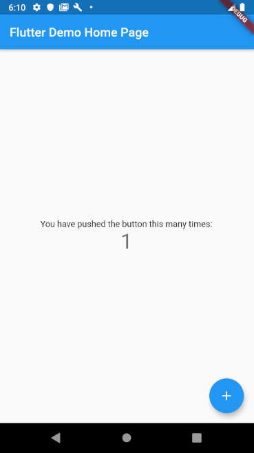
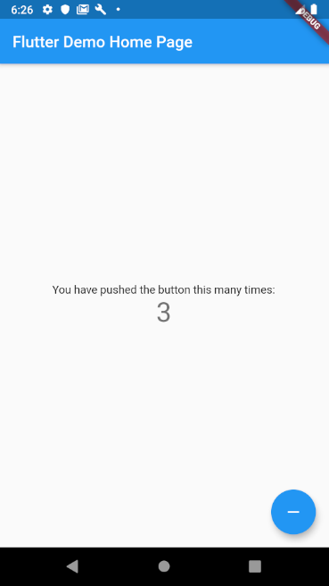
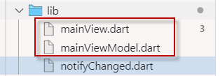

# mvvm4flight - MVVM for Flutter Light

An approach to separate presentation logic from the view: 

> *Flutter with MVVM (Model - View - ViewModel) pattern*

## About the author

I am coming from C# - from the Microsoft and Windows world. In the past 30 years, I have written many applications from real-time applications over large enterprise apps in service oriented environments to simple desktop or console applications. I love C# and I am used to Microsoft's world. 

As some kind of natural evolution I started with Xamarin making my first mobile experiences: I had done it for two years, dropped it ... came to Dart / Flutter, in February 2019.

## Introduction

When I started with Flutter I tried to understand its patterns and best practices. I found *bloc*, *streams* and many other useful things. What I haven't found so far is 

> A pattern how to separate *presentation* logic from the view (aka screen)!

### Bloc 

[https://felangel.github.io/bloc/#/architecture](https://felangel.github.io/bloc/#/architecture) stands for <u>B</u>usiness <u>Lo</u>gic <u>C</u>omponent. This pattern is useful and necessary. Bloc is the component between Presentation and Backend:

> Presentation Component (UI) - Bloc (Business Logic) - Backend (Data)

In my world, I have learned to split the View from the View Logic (aka ViewModel), and *Bloc* was not made for this. That's how it should look like:

> View + ViewModel = Presentation Component 	- Bloc - Backend

## The up- and down example

I just wanna give you an example. Forget about business logic and backend and data for a moment. Let's do a very simple app that does not anything with the entered data. Just UI and show me some numbers.

### Example 01

I have simply [created a new flutter application](https://github.com/SchmidteServices/mvvm4flight/tree/master/src/upDown01) using Visual Studio Code. You may know how it looks like:



The example is based on the following code:

```dart
 ...
 void _incrementCounter() {
    setState(() => _counter++ );
 }
 ...
 floatingActionButton: FloatingActionButton(
     onPressed: _incrementCounter,
     tooltip: 'Increment',
     child: Icon(Icons.add),       
 ),
```

Let extend the requirements a bit: 

> We do increment up to three. Then the button symbol changes to 'minus'. The functionality decrements down to zero, when the button switches again to 'plus'. It's like ping-pong between zero and three.

The required code changes look like this:

```dart
class _MyHomePageState extends State<MyHomePage> 
{
  int _counter = 0;
  bool _canIncrement = true;  // initially we increment
  bool _canDecrement = false;

  void _incrementCounter() {
    setState(() {
      _counter++;
      if (_counter == 3) {
        _canIncrement = false;
        _canDecrement = true;
      }
    });
  }

  void _decrementCounter() {
    setState(() {
      --_counter;
      if (_counter == 0) {
        _canIncrement = true;
        _canDecrement = false;
      }
    });
  }
...
floatingActionButton: 
	_canIncrement
    ? FloatingActionButton(
        tooltip: 'Increment',
        child: Icon(Icons.add),
        onPressed: _incrementCounter,
      )
    : _canDecrement
      ? FloatingActionButton(
            tooltip: 'Decrement',
            child: Icon(Icons.remove),
            onPressed: _decrementCounter,
          )
        : throw "Can't happen if logic is correct"
```

The app increments up to three, then the button changes and decrement starts:



Crazy!I would never do something like this knowing this will kill the maintenance of my app quickly (RIP)!

## Alternative using the ViewModel pattern - Example 02

Actually I was looking for something like this (see [Sample02](https://github.com/SchmidteServices/mvvm4flight/tree/master/src/upDown02)):

```dart
import 'main.ViewModel.dart';
...
class _MyHomePageState extends State<MyHomePage> 
{
	MainViewModel _viewModel = new MainViewModel();

    void initState() {
        // The view gets notifications when the ViewModel changes,
        // so that the View can rebuild --> setState().
        _viewModel.subscribe((changedPropertyName) => setState(() {}));
        super.initState();
    }

    floatingActionButton: FloatingActionButton(
          child: _viewModel.canIncrement ? Icon(Icons.add) : Icon(Icons.remove),
          onPressed: () => _viewModel.upDownCommand(),
    )
```

Just four lines of code in the view, nothing about up and down logic! How can this work?

The magic lies in the *ViewModel* 'behind' the view. 



`main.ViewModel.dart` contains all the view logic without knowing about the view or how information is displayed! 

```dart
class MainViewModel extends NotifyChanged<String> 
{
 ...
    //
    // region The public functionality that can be used in the view
    //
    int get counter => _counter;
    bool get canIncrement => _canIncrement;
    bool get canDecrement => _canDecrement;

    void upDownCommand() => _canIncrement 
    ? _incrementCommand() 
    : _decrementCommand();

    //
    // endregion
    //

    void _incrementCommand() {
      ..
      notifyChanged("counter"); // send the changed properties name
    }
	...
}
```

## Conclusion

The *ViewModel* pattern has many advantages, no disadvantage, no drawback! For me, MVVM comes at no cost, and there are only *Pros* using it. 

Think about testing! Just test the ViewModel without any Widget, UI dependency.

Think about the great designers who can create modern and fancy user-interfaces. Give the your *View* files, tell them about the functionality they can expect from the ViewModel and let them design, without knowing how the application actually performs its functions.

Finally look at Sample3 where I tweaked the UI a bit without changing the logic much.

### Example 03

You can press plus or minus, the FloatingActionButton is gone.


If you have a good designer, he / she will do it for you:


and you can concentrate on the logic - presentation logic and business logic, continuing to use *bloc*.

## Outlook

The *ViewModel* pattern is only the beginning.  Many more ideas will arise once you start thinking about it. For example, view navigation, commands, error handling and visualization. I have created a small library called *MVVM4Flight* (<u>M</u>odel -<u>V</u>iew - <u>V</u>iew<u>M</u>odel <u>for</u> <u>F</u>lutter <u>Light</u>). 

Please, let me know what you think and if you're interesting in more about *MVVM4Flight*.

